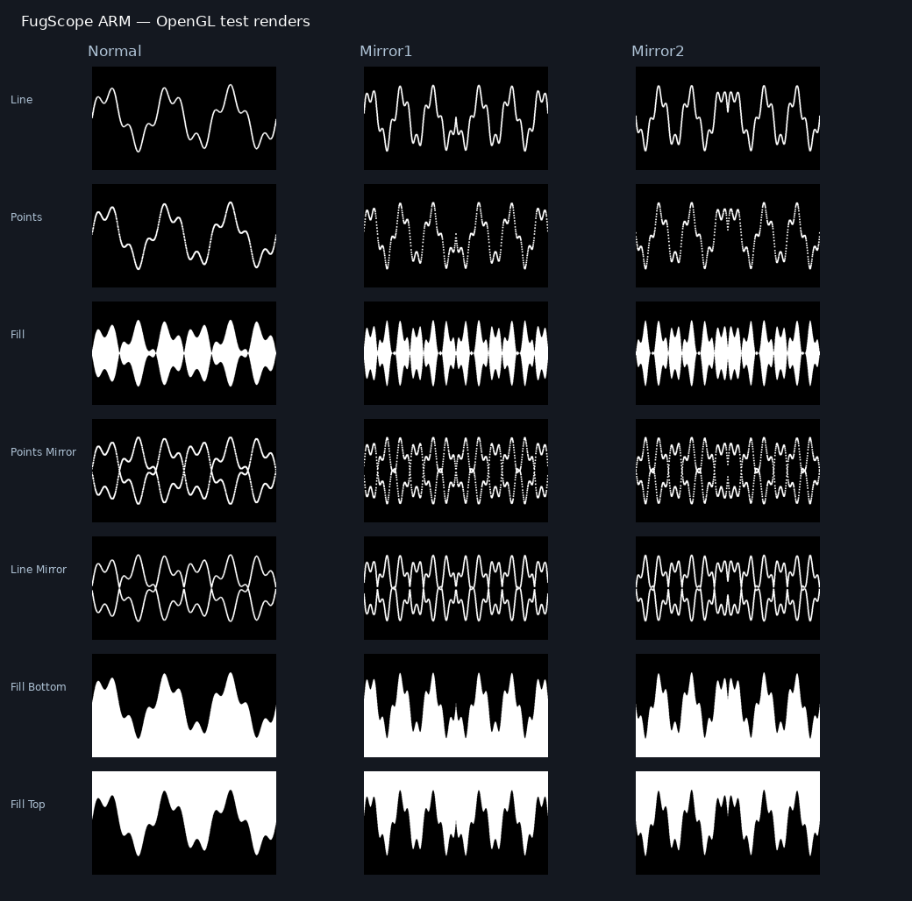

# FugScope for Resolume 7

Неофициальный порт аудиовизуализатора **fugScopeGL** Alex May / bigfug на FFGL 2.2 и OpenGL 4.1 Core. Семь режимов осциллограммы, три варианта расположения, прозрачный фон и встроенный тестовый сигнал.



## Скачать и установить

**Сборка и аккаунт GitHub не нужны.** Скачайте готовый архив для своей системы:

| Система | Скачать |
|---|---|
| Windows 10/11 x64 | [FugScope-windows-x64.zip](https://github.com/vloneonme/fugscope-resolume-arm/releases/latest/download/FugScope-windows-x64.zip) |
| macOS 11+, Apple Silicon и Intel | [FugScopeArm-universal.zip](https://github.com/vloneonme/fugscope-resolume-arm/releases/latest/download/FugScopeArm-universal.zip) |

[Все версии и примечания](https://github.com/vloneonme/fugscope-resolume-arm/releases) · [Исходники](https://github.com/vloneonme/fugscope-resolume-arm/releases/latest/download/FugScope-source.zip) · [SHA-256](https://github.com/vloneonme/fugscope-resolume-arm/releases/latest/download/SHA256SUMS.txt)

### Windows

1. Закройте Resolume и распакуйте архив.
2. Скопируйте `FugScope.dll` в `Documents\Resolume\Extra Effects`. При обновлении сохраните прежнюю DLL вне этой папки.
3. Добавьте папку в Resolume → Preferences → Video → FFGL Plugin Directories и перезапустите приложение.
4. Найдите **FugScope** в **Sources**, перетащите в клип и включите **Test Signal**.

Требуются 64-битный Resolume 7 и видеодрайвер с OpenGL 4.1. Дополнительные DLL, Visual Studio и CMake не нужны. Необязательный `install-windows.ps1` копирует DLL и сохраняет резервную копию.

### macOS

1. Закройте Resolume и распакуйте архив двойным щелчком.
2. Скопируйте **целиком** `FugScopeArm.bundle` в `Documents/Resolume/Extra Effects`. При обновлении сохраните прежний bundle вне этой папки.
3. Добавьте папку в Resolume → Preferences → Video → FFGL Plugin Directories и перезапустите приложение.
4. Найдите **FugScope ARM** в **Sources**, перетащите в клип и включите **Test Signal**.

Xcode, Homebrew и Terminal для установки не нужны. Архив Universal содержит ARM64 и Intel x86_64. На Apple Silicon нужен Resolume с поддержкой ARM FFGL; работа Mac-версии подтверждена пользователем в Resolume 7.16.

macOS bundle имеет локальную ad-hoc подпись; Developer ID и notarization пока отсутствуют. Если macOS блокирует загрузку, сохраните точное сообщение и сообщите о нём в [Issues](https://github.com/vloneonme/fugscope-resolume-arm/issues).

## Использование

Перетащите источник в клип. Включите **Test Signal**, чтобы проверить изображение без микрофона. Отключите его для захвата первого канала системного устройства ввода по умолчанию; разрешите Resolume доступ к микрофону. Аудио не берётся автоматически из композиции или системного выхода: для этого нужен настроенный виртуальный аудиовход.

- **Config** — семь режимов отображения.
- **Arrange** — три варианта расположения.
- **Scale** — усиление амплитуды от 0 до 10.
- **Width** — толщина от 1 до 50.

ID плагина — `FSAR`; он не заменяет оригинальный `BF24`. Старые композиции оригинала не мигрируют автоматически.

## Структура и разработка

[Инструкция сборки](docs/building.md) · [Порядок выпуска релиза](docs/releasing.md)

`src/` — реализация; `vendor/` — необходимые исходники зависимостей; `scripts/` — сборка и установка; `tests/` — проверки; `resources/` — метаданные; `reference/` — исходные алгоритмы для сравнения; `docs/` — документация.

```bash
bash scripts/test-core.sh
```

На Linux графические проверки запускаются через `scripts/test-linux-gl.sh` с GLEW/EGL development libraries. Сборки создаются в `build/`, архивы — в `dist/`; эти каталоги не входят в Git.

## Статус

Mac-версия работает по подтверждению пользователя. Windows x64 DLL собрана MinGW и нативно MSVC в GitHub Actions; core/audio/LoadLibrary тесты прошли. macOS Universal и Linux OpenGL CI также прошли. Проверка изображения и реального аудиовхода в Windows Resolume ещё требуется. Контекст и границы проверок: [docs/validation.md](docs/validation.md). [Первый релиз v1.0.0 опубликован](https://github.com/vloneonme/fugscope-resolume-arm/releases/tag/v1.0.0), его сборки и проверки прошли. Готовые архивы распространяются через Releases; Actions используется только для автоматической сборки проекта. Следующий шаг проверки — запуск Windows-источника в Resolume с Test Signal и реальным аудиовходом.

## Лицензия

GPL-3.0-only. Автор оригинала — Alex May / bigfug. Это неофициальный проект, не релиз bigfug или Resolume. При распространении бинарников предоставляйте соответствующие исходники. Версии и лицензии зависимостей перечислены в [NOTICE.md](NOTICE.md).
